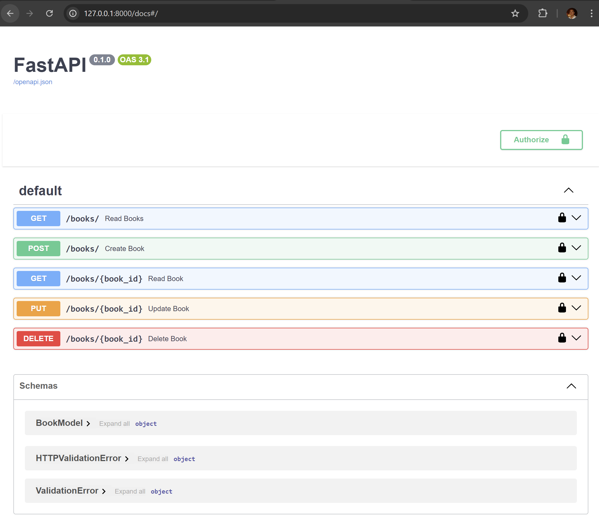
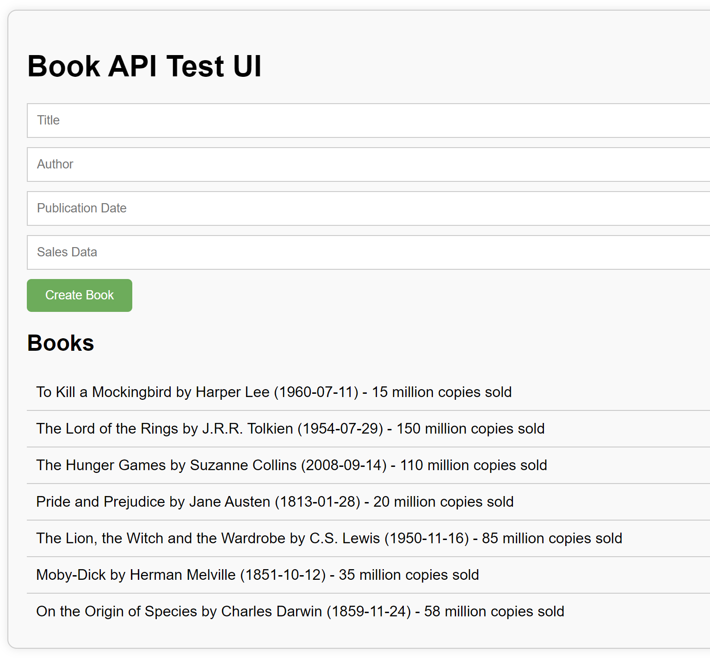

### Scenario:
You are a data scientist working for a company that specializes in analyzing and providing insights on book sales data. Your task is to create a RESTful API that allows users to retrieve information about books, including their titles, authors, publication dates, and sales data.

### Requirements:
1. The API should have the following endpoints:
- GET /books: Returns a list of all books in the database.
- GET /books/{id}: Returns information about a specific book, including its title, author, publication date, and sales data.
- POST /books: Creates a new book in the database.
- PUT /books/{id}: Updates an existing book in the database.
- DELETE /books/{id}: Deletes a book from the database.

2. The API uses a simple mysql database to store book data. You can use another database management system you like, but you must provide instructions on how to set it up and use it.

3. The API should handle errors and exceptions properly, including validation errors, database errors, and HTTP errors.

4. The API should be secure, using HTTPS and authentication/authorization mechanisms to protect against unauthorized access.

The code in this folder provides a basic structure for the API, including the endpoints, database model, and error handling. However, it is incomplete and will require additional work to implement the requirements listed above.

### Instructions:
1. Pull the latest changes from the class Github page. The starter code for assignment 2 is available under the folder `Assignment_2`. 

2. Starter code uses FastAPI to setup the different API endpoints. Consult their documentation for more details: https://devdocs.io/fastapi/

3. Run `uvicorn main:app` to run the app locally and start debugging debug. Once the app is running, you will be able to access the Swagger documentation here: http://127.0.0.1:8000/docs#/. You are encouraged to use the FastAPI documentation to test changes to the API and use the console to debug issues. 

4. Complete the implementation of the API, including the endpoints, database model, and error handling.

5. Complete implementation of the GET, POST, PUT and DELETE methods in `main.py` file. 

6. Fix the UI (in index.html) so you can get the results and the UI looks like this when it loads. You need to add authorization headers in both the GET and POST calls in the index.html file to make this possible. You can access the test UI for the app here: http://127.0.0.1:8000/static/index.html

7. Your submission should include a zipped copy of the entire contents of `Assignment_2` folder. Also include a screenshot of the index.html page with the following book data visible in the list. Include your screenshot inside the `static` folder where the `index.html` file already lives. 
- Title: The Great Gatsby
- Author: F SCOTT FITZGERALD
- Publication Date: 1925/04/10
- Sales Data: 30 million copies sold

8. Authentication/authorization mechanisms have been implemented to protect against unauthorized access. Make sure to use the dummy API key `your_api_key_here` to test your implementation. Feel free to use your own (more secure) API keys as well. 

9. Test the API thoroughly to ensure that it works as expected.

### Grading:
The assignment will be graded based on the following criteria:
- Completeness and correctness of the implementation (50%)
- Quality of the code, including organization, readability, and maintainability (20%)
- Thoroughness and effectiveness of testing (20%)
- Quality of the instructions and documentation (10%)

